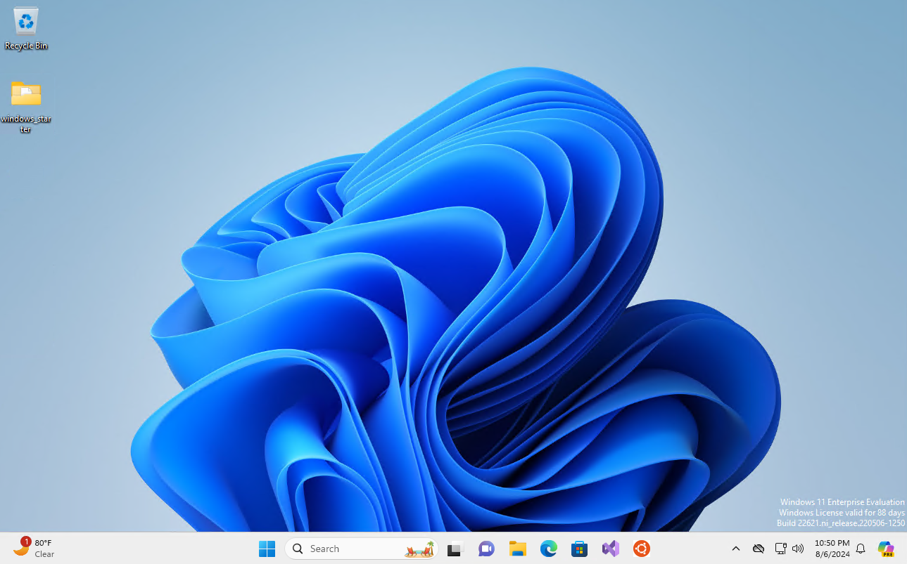
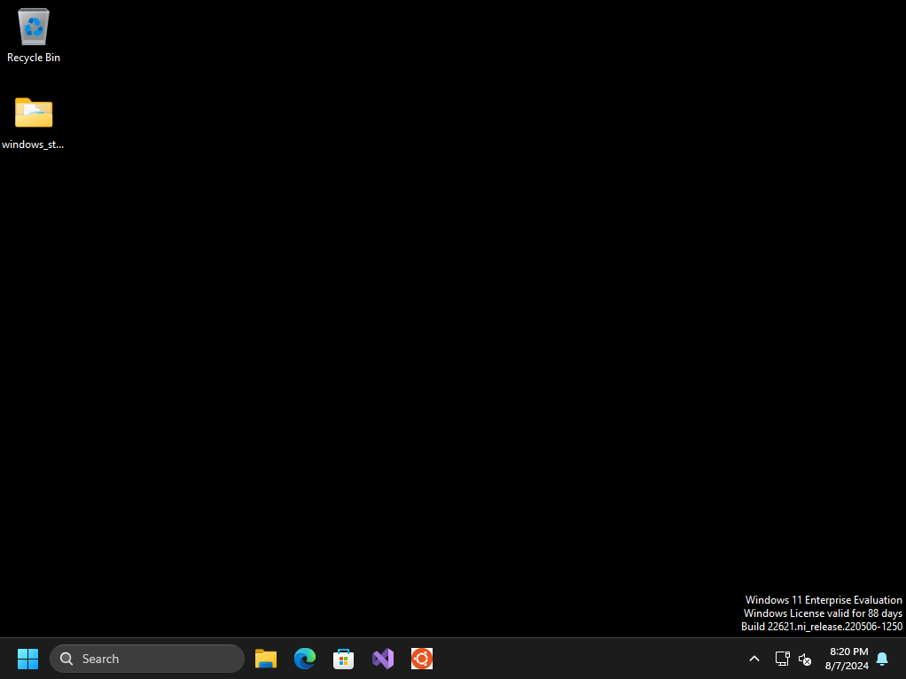

# Install

Open terminal as an admin then run:

`Set-ExecutionPolicy -ExecutionPolicy Unrestricted; ./run_me_as_admin.ps1`

and wait for it to complete. It can take roughly 15 minutes depending on what applications
you want to install via `install_apps.py`

# Before & After

